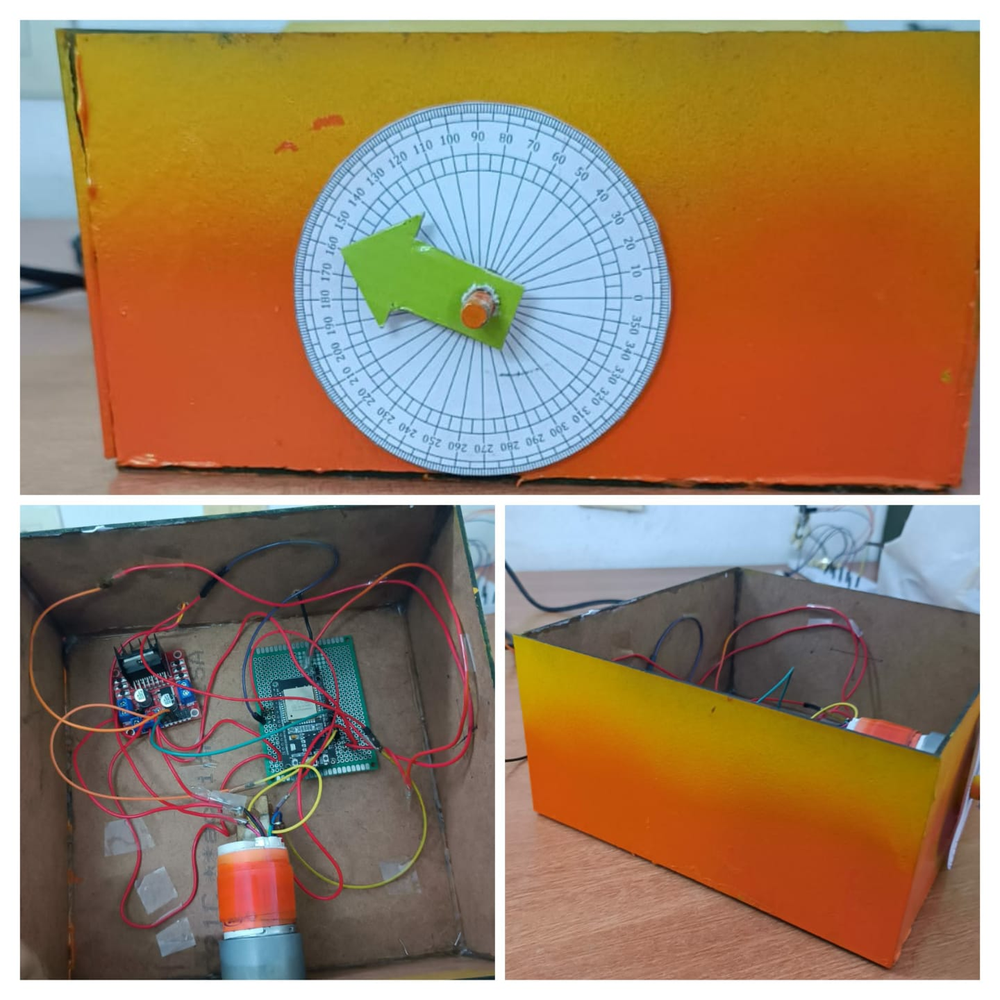

# ESW Project - Anush, Mukta, Ronak, Sriya

This repository contains our ESW (Embedded Systems Workshop) group project made in my second year (November 2022).
The aim of the project was to demonstrate the principle of feedback control and the value of remote labs through the software dashboard. Refer to `Report.pdf` for more details.

- `Report.pdf` contains the report of the project.
- `presentation.pdf` contains the overview slides.
- `dashboard` contains the code for the dashboard.
- `headers.h` contains the header files for the code for the ESP32 module.
- `finalcode.cpp` contains the code for the ESP32 module.

